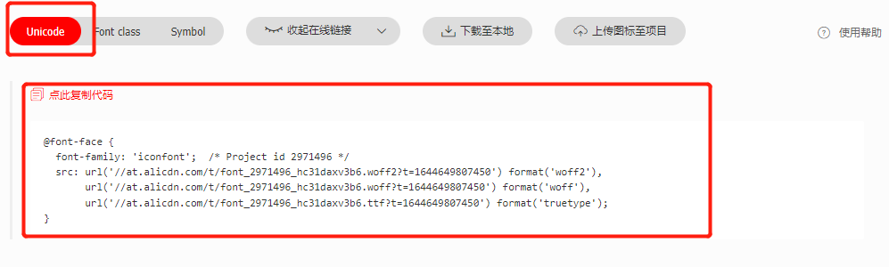
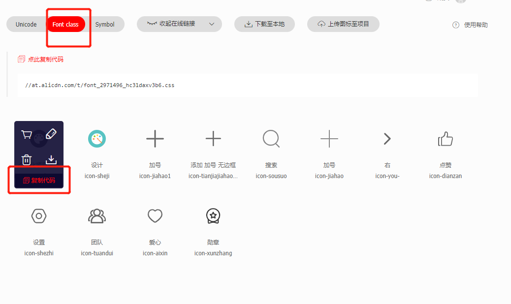
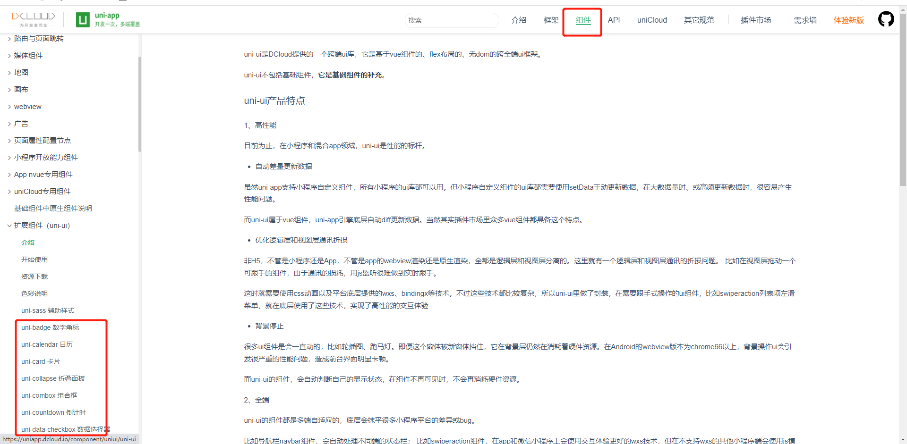

本节将介绍如何在项目中引入 baseConfig，和常用的外部资源
## 引入共通配置

### baseConfig全局引入

只需要在main.js增加以下代码：
``` js {3,8,22}
// main.js
// 引入全局baseConfig
import baseConfig from 'baseConfig';

// 如果项目使用Vue2
// #ifndef VUE3
import Vue from 'vue'
Vue.use(baseConfig);

const app = new Vue({
  ...App
})
app.$mount()
// #endif

// 如果项目使用Vue3
// #ifdef VUE3
import {createSSRApp} from 'vue'

export function createApp() {
  const app = createSSRApp(App)
  app.use(baseConfig);
  return {
    app
  }
}
// #endif
```
## iconfont图标引入

### 获取图标

以下所有说明都是基于阿里图标库进行扩展，其他图标库同理，明白原理即可方便扩展

1. 访问 [阿里图标库](https://www.iconfont.cn/)，搜索图标并加入购物车：


2. 点击页面右上角购物车图标 ，点击添加至项目，如没有项目，需要点击下图第二步的图标添加一个项目目录，如已经有项目则可以略过第二步，选择项目后点击确定：


3. 确定后进入项目，点击项目设置 ，对图标库进行一些设置：


4. 项目名称和项目描述根据自己需求填写，格式可以只勾选 ttf：


5. 点击保存后 ，可以下载图库库到本地:


6. 下载解压后，需要用到的文件暂时有两个 iconfont.css、iconfont.ttf:


7. 将 iconfont.ttf、iconfont.css 放到项目根目录 static/iconfont 下替换源文件:

8. 打开 iconfont.css ,修改 @font-face 如下,将下面代码复制到本地的iconfont.css文件中替换原来的代码，只需要留最后一行，并加上https:：



修改之后如果就可以：
```
@font-face {
  font-family: 'iconfont';
  src: url('https://at.alicdn.com/t/font_2971496_q3ve1y7i95.ttf?t=1638273885160') format('truetype');
}
```

### 代码中使用iconfont

复制红框中的代码，放在标签中即可，前提是在class中添加 `iconfont` 属性



``` html
<i class="iconfont icon-dianzan"></i>
```

## 引入组件
### uni-app官方组件

1. 在官网中选择自己需要的组件


2. 点击下载&安装

3. 右侧使用HBuilderX导入插件

4. 组件会生成在项目的根目录下uni_modules文件中，直接按照官网中的方式使用即可，不需要import导入 和 component中引用

### uView组件

[uView官网](https://www.uviewui.com/components/install.html)，点击下载地址，进入插件市场，使用HBuilderX导入插件，不建议用npm下载
